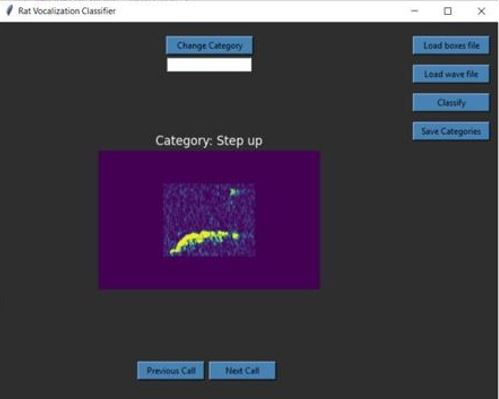
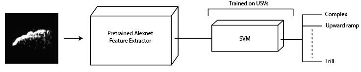
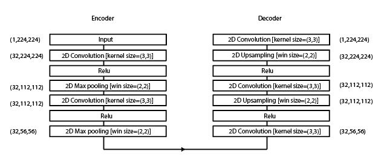
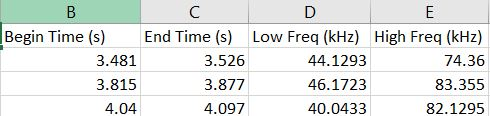

# 50-kHz-Rat-Ultrasonic-Vocalization-Classifier-[Alexnet (Transfer learning)+SVM]
This is a GUI package written in python containing 50 kHz rat vocalization classifier. This model  classifies vocalizations based on their shape in spectrogram domain. The classifier is trained on 13 categories including {'Complex', 'Down ramp','Flat', 'Flat-trill', 'Inverted U','Multi', 'Step down','Short', 'Split', 'Step up', 'Trill with jumps', 'Trill', 'Up ramp'}. Whatever category other than these categories will be labled as 'Unknown'.



## Model architecture:
For feature extraction the model uses pre-trained AlexNet weights and then SVM is applied to classify the calls



We also trained an denoising autoencodr to remove the background noise from the spectrograms



## Required Packages
```
scipy==1.6.1
numpy==1.19.5
matplotlib==3.3.4
tkinter==8.6
pandas==1.2.2
skimage==8.6
scikit-learn==0.24.1
Pillow==8.1.0
scipy==1.6.1
pytorch==1.6.0
torchvision==0.7.0
tensorflow==2.4.1
```

## Usage
Run the following code to  start the gui

```
python Classifier_GUI.py

```

In order to use the classifier, the coordinates of the box around each call in spectrogram should be given to the package. The box coordinates include lower frequency , higher frequency, start time and end time of the each call.
<br/> These coordinates should be in a file with CSV format and with headers shown in below:



<br/> You can also use Deepsqueak (https://github.com/DrCoffey/DeepSqueak) software package to automatically extract call coordinates. Deepsqueak has also the classification option but it is trained on 11 categories. In Deepsqueak there is an option that you can export information to Excel xlsx file. Then you need to open the xlsx file and save the sheet as CSV format to upload it to the GUI.
<br/>
<br/>
<br/> You need to load the audio file as WAV format using the "Load Wave File" button.
<br/>
<br/>
#### You can also change the calls label after the classification, in case if you think the label is not true, using the change category button after typing the label in the box

